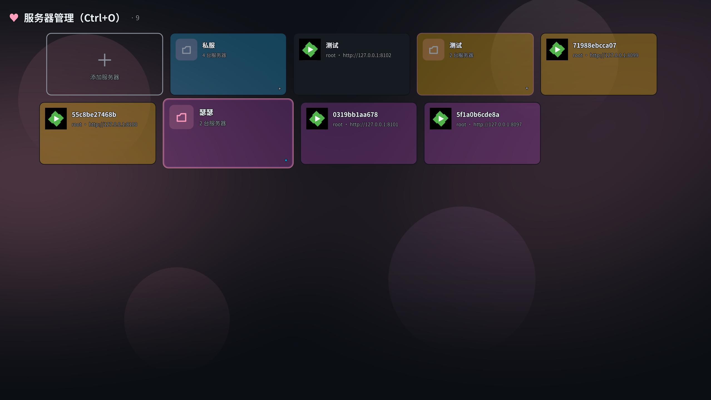
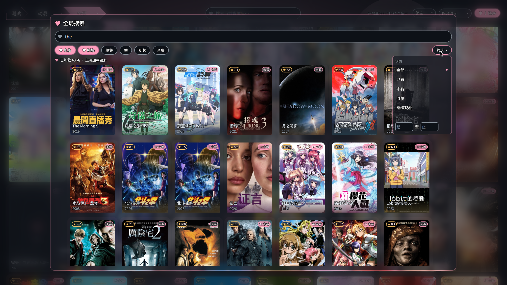
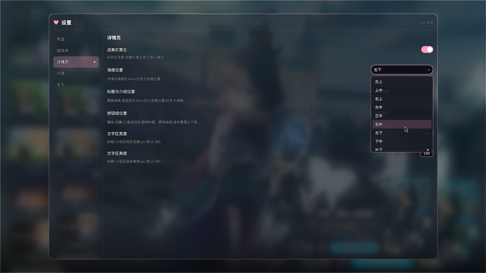

# MoePlayer

**MoePlayer** 是一个纯本地的 Emby 第三方客户端,基于 **Qt 6 / QML** 构建,播放由**外部 mpv 进程**(JSON IPC)承担。

> ### 🚧 开发中(2026-08)
>
> - **目前仅支持 Linux**(Windows 规划中)
> - **开发阶段,不推荐日常使用**:接口与行为可能随时变化
> - 界面截图仅代表当前开发进度,**非最终效果,以最终发版为准**

> 主题系统:11 套配色(亮/暗)× 5 个动态背景效果(落樱/萤火/星空流星/夜雨/无),毛玻璃弹层;亮暗双配色自动切换文字与玻璃参数。

## 功能特性

| 功能 | 说明 |
|:--|:--|
| **MPV 播放** | 外部 mpv 进程(JSON IPC),播放窗口独立;进度续播(IsResumable) |
| **服务器管理** | 多服务器账号与凭据管理,添加/编辑/移除;文件夹分组;单服务器或整组隐藏(Alt+S 临时露出) |
| **媒体库浏览** | 面包屑链导航(服名 ▸ 媒体库 ▸ 文件夹),递归条目加载,子文件夹下钻 |
| **多维筛选** | 类型 / 评分 / 状态单选 + 年份区间输入(自动枚举为年份列表),激活计数徽标,一键清除 |
| **库内搜索** | 头部搜索栏(防抖 300ms),SearchTerm 与筛选/排序/分页正交,搜索激活时排序置灰 |
| **全局搜索** | 毛玻璃搜索浮窗,状态/年份/类型筛选,结果网格分页加载 |
| **详情页** | 元数据、演员、媒体源信息、相似推荐(hover 放大)、收藏 / 已看状态 |
| **设置浮窗** | Ctrl+S / 首页按钮开关;左分类 / 右设置项两级面板;界面/媒体库/详情页/代理/关于分类,开关/下拉/输入直连 ConfigManager(config.toml 热重载) |
| **主题系统** | 配色 × 背景效果正交预设、亮暗双主题、毛玻璃弹层、卡片 hover 放大浮起 |

## 界面预览

截图位于仓库根目录 `screenshots/`,仅反映当前开发进度,**非最终效果**:

<table>
  <tr>
    <td width="50%"><br><sub><b>媒体库</b>(头部单行:面包屑 + 搜索栏 + 筛选)</sub></td>
    <td width="50%"><br><sub><b>服务器管理</b></sub></td>
  </tr>
  <tr>
    <td><br><sub><b>全局搜索浮窗</b></sub></td>
    <td><br><sub><b>详情页</b></sub></td>
  </tr>
  <tr>
    <td><br><sub><b>设置浮窗</b>(Ctrl+S / 首页按钮;左分类右设置项,详情页海报下拉打开中)</sub></td>
  </tr>
</table>

## 环境要求

- CMake ≥ 3.21
- Qt ≥ 6.8(Core, Gui, Quick, QuickControls2, Network, WebSockets, ShaderTools)
- 播放依赖:**运行期**外部 mpv(≥ 0.38,需在 PATH;打包依赖随包声明),构建期不需要

## 构建

```bash
cmake -B build
cmake --build build -j$(nproc)
./build/MoePlayer
```

构建产物内嵌 QML 模块(qmldir/qmltypes)与预编译 shader(.qsb),无需额外拷贝资源。

### Windows

```powershell
cmake -B build -G "Visual Studio 17 2022" -A x64
cmake --build build --config Release
windeployqt --qmldir qml --release --no-compiler-runtime --no-translations --dir package build\Release\MoePlayer.exe
Copy-Item build\Release\MoePlayer.exe package\
Copy-Item -Recurse resources\lua,resources\shaders package\
```

CI(`build` 工作流,手动触发)的 `windows` 作业产出 NSIS 安装包
`MoePlayer-Setup-<版本>.exe`(windeployqt 运行时 + VC++ 官方运行库安装器 +
lua/shaders + 开始菜单快捷方式与卸载器)。HTTPS 走 Qt 自带的 Schannel TLS
后端,无需分发 OpenSSL;播放仍需外部 mpv(安装器完成页有提示:PATH 或安装
目录下放 mpv.exe)。

## 使用

1. 启动后在服务器管理页添加 Emby 服务器地址
2. 登录获得凭据(或已有账号直接连接)
3. 进入媒体库:面包屑导航 / 筛选 / 搜索
4. 点击卡片播放(外部 mpv 窗口)
5. `Ctrl+S` 打开设置浮窗:左分类 / 右设置项,值改动即时写入 config.toml 并热重载
6. 服务器卡片 `Ctrl+点击` 打开修改浮窗(改名 / 换图标 / **隐藏服务器**);
   文件夹浮窗可整组隐藏(成员一并隐藏);`Alt+S` 临时露出隐藏项,再按一次收起

## 技术架构

- **QML 模块化**:所有 QML + C++ 类型归入 URI `MoePlayer.Core`,`qt_add_qml_module` 生成 qmldir/qmltypes,资源嵌入 `qrc:/qt/qml/MoePlayer/Core/`
- **C++ 核心**:`EmbyClient`(API 请求与模型填充)、`AccountManager`(账号凭据,accounts.json)、`ConfigManager`(配置持久化,config.toml)、媒体 / 海报 / 取色模型
- **播放**:内嵌 libmpv(QML 界面,默认)或外部 mpv 进程 + JSON IPC(`src/playback/MpvClient`,双模式共用同一套会话/回传逻辑)
- **主题**:`ThemeStore`(配色 × 效果预设)→ `Theme`/`Constants` 令牌三层;参数化动态背景 `ThemedBackground`(background.frag,落樱/萤火/星空流星/夜雨/无);毛玻璃 `GlassPanel`/`FrostedGlass`(ShaderEffectSource + 折射 shader,共享抓取 `GlassBlurSource`)

## 目录结构

```
qml/
  Main.qml            应用入口
  theme/              主题与通用组件(ThemeStore, Theme, Constants, AppText, GlassPanel, FrostedGlass, GlassBlurSource, ThemedBackground, CrossfadeImage …)
  views/              页面(ServerManager, Library, Detail, SearchOverlay, PosterCard, SettingsOverlay …)
  assets/             数字动画帧(counter)
src/
  core/               EmbyClient / AccountManager / 配置持久化
  models/             条目 / 海报 / 取色模型
  playback/           外部 mpv 进程管理 + JSON IPC(MpvClient)
shaders/              动态背景(落樱/萤火/星空/夜雨)/ 玻璃折射 / 转场 shader
third_party/          tomlplusplus(配置解析)
```

## 免责声明

- MoePlayer 是一款**纯本地播放器 / 第三方客户端**,自身**不提供、不存储、不托管、不分发任何影视资源**,也不内置任何内容源。
- 应用内展示与播放的所有媒体,均来自**用户自行添加的服务器(如 Emby)**,资源的来源、版权与合法性**由用户自行负责**。
- 请仅用于播放你**依法拥有或已获授权**的内容,并遵守你所在国家/地区的法律法规。
- 本项目为**免费开源**软件;商店付费版(规划中)的功能与免费版完全一致,其收入仅作为对项目的捐赠,项目**不以任何形式从内容传播中获利**。

## 许可证与发行

[GPL-3.0](LICENSE)。第三方组件声明见 [THIRD-PARTY-NOTICES.md](THIRD-PARTY-NOTICES.md)。

发行模式参考 [Krita](https://krita.org)(开源免费 + 商店付费捐赠):

- **免费版**:本仓库开源分发(GPL-3.0),功能完整
- **付费版**(规划中,待 Windows 支持完成后):上架 Microsoft Store,功能与免费版完全一致;扣除平台费用后所得用于支持项目存续与发展,视为对项目的捐赠

GPL-3.0 允许收费分发,义务为随附源码获取方式(本仓库即源码)。

## 致谢

- [Qt](https://www.qt.io) — 跨平台 UI 框架
- [mpv](https://github.com/mpv-player/mpv) — 外部播放器(JSON IPC 承担播放)
- [Emby](https://emby.media/) — 媒体服务器
- [tomlplusplus](https://github.com/marzer/tomlplusplus) — 配置解析
